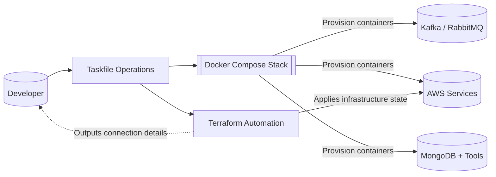

# Infrastructure

The project relies on a combination of Terraform and Docker Compose to provide reproducible infrastructure for local development and integration testing. This document outlines the moving parts, how they interact, and the recommended commands for day-to-day operations.

## Platform Topology



The flowchart illustrates how the developer experience is centered around `task` automation. Tasks fan out into Docker Compose to boot containerized dependencies and into Terraform to ensure cloud-mimicking resources (via LocalStack) stay in sync.

## Terraform Automation

- Source files live in `infra/terraform` and are organized by environment modules.
- `main.tf` captures the AWS (LocalStack) resources required by the service: topics/queues, IAM stubs, and supporting storage.
- Remote state is not used for local development; Terraform relies on the local state files under `.terraform/`.

Common workflow:

```bash
cd infra/terraform
terraform init   # one-time backend and provider install
terraform plan   # review drift before applying
terraform apply  # provision or update LocalStack resources
```

When Docker Compose initializes LocalStack, Terraform can be re-run to reconcile infrastructure definitions with the emulated AWS endpoints.

## Docker Compose Profiles

Docker Compose files under `infra/compose/` layer on top of the base `docker-compose.yml`. Each override activates a different messaging backend:

- `docker-compose.kafka.yml` – Spins up Kafka, ZooKeeper, and observability helpers.
- `docker-compose.rabbitmq.yml` – Starts RabbitMQ with management UI and schema tooling.
- `docker-compose.aws.yml` – Targets LocalStack for SNS/SQS integration testing.

Start a stack explicitly by referencing the base file and desired override:

```bash
cd infra/compose
docker compose -f docker-compose.yml -f docker-compose.kafka.yml up --build
```

Alternatively, leverage the Taskfile wrappers from the repository root:

```bash
task up-kafka     # Kafka stack with supporting services
task up-rabbitmq  # RabbitMQ stack
task up-aws       # LocalStack-backed AWS stack
```

Compose configurations mount `_volume_data/` for data persistence across restarts. When switching stacks, remove or backup these directories if you need a clean slate.
