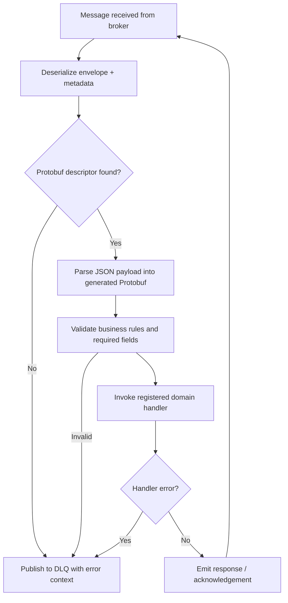

# Message Processing Flow

Incoming events traverse a consistent pipeline that handles schema negotiation, validation, execution, and error routing. The following sections document the lifecycle so that new handlers can be built confidently and observability remains intact.

## Event Lifecycle Overview



## Processing Stages

### Envelope extraction

- Consumer adapters normalise Kafka, RabbitMQ, or SNS/SQS records into an internal envelope that carries metadata, routing keys, and payload bytes.

### Schema resolution and decoding

- Metadata drives selection of the generated Protobuf type.
- JSON payloads are unmarshalled into the generated struct; malformed messages retain the original payload for diagnosis and will be sent to the DLQ.

### Validation

- Validation rules produced by `buf.validate` guard business constraints and required properties.
- CEL is used to express complex invariants that go beyond basic field checks.
- Failures are logged with structured context and the event is redirected to the dead-letter queue (DLQ).

### Handler execution

- Registered (typed) handlers need to be invoked with a strongly typed request struct.
- Returning an `UnprocessableEventError` signals that retries should stop and the DLQ path should be followed.

### Response emission

- Handlers can either publish to a response topic and perform side effects such as persisting to the database or calling external APIs.
- Acknowledgements are propagated back to the original broker to advance offsets safely.

## Sample Handler Implementation

```go
package handlers

import (
    "context"

    "github.com/ThreeDotsLabs/watermill/message"
    "drblury/event-driven-service/internal/domain/signup"
    "drblury/event-driven-service/internal/usecase"
)

func NewSignupHandler(service usecase.SignupService) message.HandlerFunc {
    return func(ctx context.Context, msg *message.Message) error {
        payload, err := signup.UnmarshalMessage(ctx, msg)
        if err != nil {
            return signup.NewUnprocessableErr("decode failure", err)
        }

        if err := service.Process(ctx, payload); err != nil {
            return signup.NewUnprocessableErr("business rule violation", err)
        }

        msg.Metadata.Set("status", "processed")
        return nil
    }
}
```
