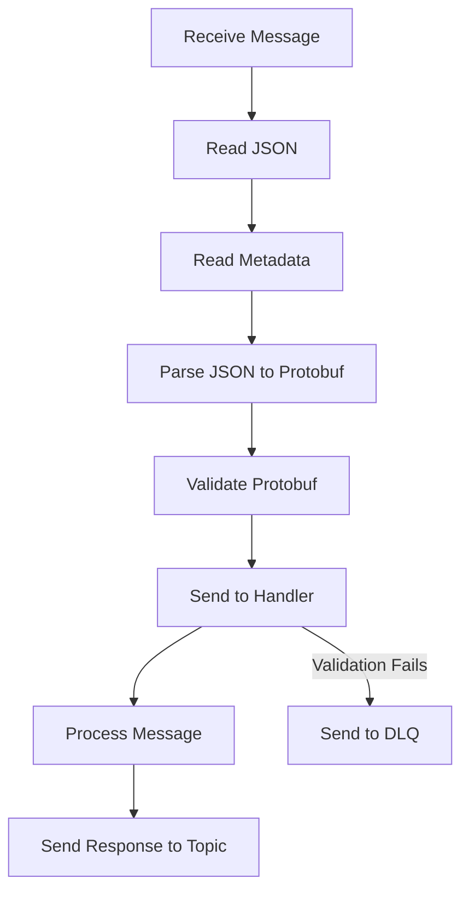

# Message Processing Flow

This section explains the process when a message is received by the service.

## Flow Overview

## Steps

1. **Receive Message**:
   - Messages comes from a pub/sub system.

2. **Read JSON and Metadata**:
   - Extract the JSON payload and metadata from the message.

3. **Parse JSON to Protobuf**:
   - Convert the JSON payload into the appropriate Protobuf structure given by the metadata.

4. **Validate Protobuf**:
   - Validate the Protobuf structure. If validation fails, send the message to the DLQ (Dead Letter Queue). Use the validation errors in the Protobuf structure to log and send to DLQ.

5. **Send to Handler**:
   - Pass the raw JSON to the handler for further processing.

6. **Process Message**:
   - The handler processes the message by performing the required business logic. It wil handle unmarshalling the JSON into the Protobuf generated struct as well as any further processing.
   It will NOT handle validation or sending to DLQ. This is done before the handler is called.
   If the handler encounters an error, it can return an error which will be logged and the message will be sent to the DLQ. This needs to be a UnprocessableEventError to indicate that the message is not processable and should not be retried.

7. **Send Response**:
   - Send the response to a predefined topic.

## Handler Structure

- Handlers are defined in the `src/internal/events/handlers.go` file.
- Prefer the use of the addHandlerWithType function to define handlers. (This will ensure that the handler is properly registered with the correct input and will perform protobuf validation before calling the handler function).
- Handlers are responsible for processing messages.
- Each handler contains the following components:
  - **consumeEventType**: The Protobuf structure.
  - **consumeQueue**: The topic from which the handler receives messages.
  - **produceQueue**: The topic to which the handler sends responses.
  - **handlerFunc**: The function that processes the message.
