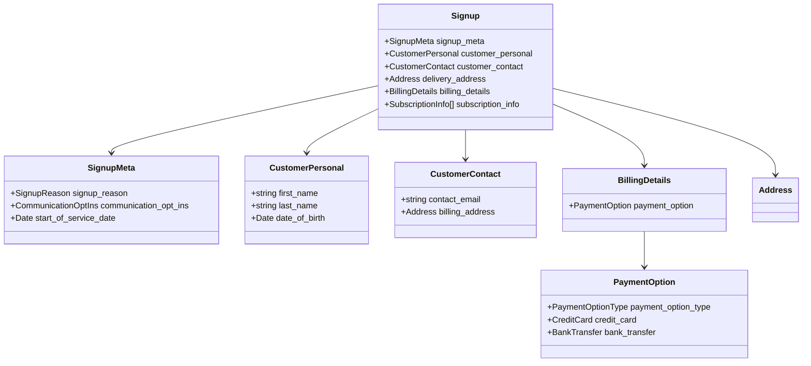

# Protobuf and Domain Models

Protocol Buffers define the canonical shape of business entities in this service. Protobuf definitions drive domain validation, handler contracts, and API payloads in a single source of truth.

## Why the project relies on Protobuf

1. **Centralised validation** – `protoc-gen-validate` generates structured validation logic so invalid messages are rejected consistently before hitting business logic.
2. **Language neutrality** – The same `.proto` files can be consumed by Go services, TypeScript tooling, or future polyglot consumers.
3. **Optimised serialization** – Binary wire formats keep message sizes predictable and efficient across the supported brokers.
4. **Documentation alignment** – OpenAPI schemas and domain models stay in sync by sharing types and enumerations.

## Key domain relationships



The diagram mirrors the core `signup.proto` aggregates under `proto/domain`. Every handler expecting a signup event receives a generated Go struct with this composition.

## Authoring tips

- Place shared types in `proto/domain` so they can be imported by multiple service modules.
- Keep enum values lowercase-with-underscores to match idiomatic Go constant generation.
- Include comments above fields; they are propagated into generated Go code and the bundled OpenAPI schema.

### Example excerpt

```proto
syntax = "proto3";

package domain;

import "address.proto";
import "customer.proto";

message Signup {
   SignupMeta signup_meta = 1 [(validate.rules).message.required = true];
   CustomerPersonal customer_personal = 2 [(validate.rules).message.required = true];
   CustomerContact customer_contact = 3;
   Address delivery_address = 4 [(validate.rules).message.required = true];
   BillingDetails billing_details = 5;
}
```

### Regenerating code

Run the repository Task to regenerate all generated sources and validation helpers:

```bash
task gen-buf
```

The command uses Buf to lint, format, and compile definitions into Go packages under `src/internal/domain` and `src/pkg/events`.
