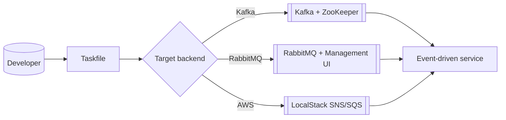

# Pub/Sub Systems

The application can be executed against Kafka, RabbitMQ, or AWS SNS/SQS (via LocalStack). Each stack is fully scripted so that switching backends only requires changing the Docker Compose override and its companion environment variables.

## Selection Matrix



Use this matrix as a reminder that only one backend should be running at a time to avoid port clashes.

## Configuration Reference

| Backend | Docker Compose override | Environment file | Typical use case |
| --- | --- | --- | --- |
| Kafka | `infra/compose/docker-compose.kafka.yml` | `infra/env/kafka.env` | High-throughput workloads and partition-aware testing |
| RabbitMQ | `infra/compose/docker-compose.rabbitmq.yml` | `infra/env/rabbitmq.env` | Routing-key patterns, dead-lettering, and priority queues |
| AWS (LocalStack) | `infra/compose/docker-compose.aws.yml` | `infra/env/localstack.env` | SNS/SQS semantics, FIFO queues, and IAM policy validation |

## Example: launching Kafka stack

```bash
cd infra/compose
docker compose -f docker-compose.yml -f docker-compose.kafka.yml up --build
```

The Taskfile provides convenience wrappers. From the repository root:

```bash
task up-kafka
```

## Environment variable snippet

Each backend exposes a dedicated `.env` file. The snippet below shows the RabbitMQ defaults as a template to customise credentials or vhosts:

```env
RABBITMQ_DEFAULT_USER=admin
RABBITMQ_DEFAULT_PASS=admin
RABBITMQ_DEFAULT_VHOST=event-driven
WATERMILL_BROKER=rabbitmq
WATERMILL_PUBLISH_EXCHANGE=events
```

After adjusting environment files, recycle the Docker Compose stack to ensure configuration changes are picked up.
