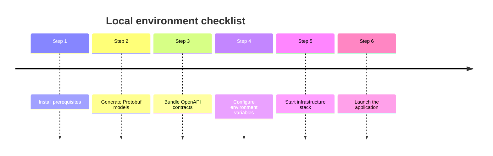

# Setup Guide

Follow this guide to provision tooling, generate code, and launch the Event-Driven Service Example in a reproducible way.

## Timeline



## 1. Install prerequisites

- Docker Desktop (or an equivalent container runtime with Compose V2 support).
- Go 1.22 or newer (see `src/go.mod` for the canonical version).
- Taskfile CLI for repeatable workflows: `brew install go-task/tap/go-task`.

Verify the toolchain:

```bash
docker --version
go version
task --version
```

## 2. Generate Protobuf-backed domain models

From the repository root, generate the domain layer and validation rules:

```bash
task gen-buf
```

Generated Go code is emitted under `src/internal/domain` alongside helper packages used during message handling. Re-run this command whenever `.proto` files change.

## 3. Bundle OpenAPI definitions and client stubs

The API definitions in `api/api.yml` are split across resources and schemas. To produce a bundled specification and fresh Go types:

```bash
task gen-api
```

Artifacts are written to `src/pkg/api` and the `api/resources` folder gains consolidated JSON/YAML bundles for documentation.

## 4. Configure environment variables

- Copy a profile from `infra/env/example/` into `infra/env/` for the desired messaging backend.
- Update `app.env` with local credentials, ports, or tracing endpoints.
- Keep secrets out of version control by leveraging the `.env` pattern and tooling such as `direnv` where appropriate.

## 5. Start the dependency stack

Choose the messaging backend that suits your testing scenario. Example for Kafka:

```bash
cd infra/compose
docker compose -f docker-compose.yml -f docker-compose.kafka.yml up --build
```

To speed things up during iterative development, use the Taskfile wrappers (`task up-kafka`, `task up-rabbitmq`, `task up-aws`).

## 6. Launch the application

With infrastructure running, start the service from `src/`:

```bash
cd src
go run ./cmd/service
```

Hot reloading is achievable by pairing the command above with tools such as `air` or `reflex`; just ensure rebuilds happen inside the `src` module to honour Go workspaces.
