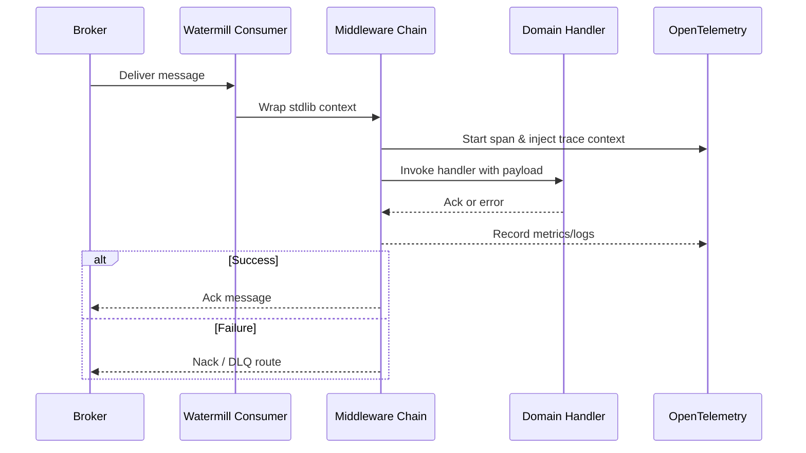

# Watermill and OpenTelemetry

Watermill provides the messaging abstractions that underpin this service, while OpenTelemetry captures traces, metrics, and structured logs to observe handler performance. Together they deliver a consistent developer experience regardless of the underlying broker.

## Orchestrated message handling



## Watermill integration notes

- The project centralises subscriber configuration in `src/internal/server`. Each handler is registered with Watermill using helper functions that apply consistent middleware.
- Retry, circuit-breaking, and dead-letter routing behaviour is configured per backend via Watermill plugins.
- Correlation IDs and tenant identifiers are normalised as Watermill metadata to support cross-service tracing.

## OpenTelemetry practices

- Traces are emitted to the collector specified in `infra/env/openobserve.env`, including the broker, Watermill subscriber, and domain handler spans.
- Structured logging enriches every span with key message identifiers (offset, partition, routing key) to accelerate troubleshooting.
- Metrics cover handler duration, DLQ counts, and retry attempts; they can be visualised inside OpenObserve or any OTLP-compatible backend.

## Example middleware declaration

```go
package messaging

import (
    "github.com/ThreeDotsLabs/watermill/message"
    "github.com/ThreeDotsLabs/watermill/message/router/middleware"
    "go.opentelemetry.io/contrib/instrumentation/github.com/ThreeDotsLabs/watermill/otelwatermill"
    "go.opentelemetry.io/otel/propagation"
)

func DefaultMiddlewares() []message.HandlerMiddleware {
    return []message.HandlerMiddleware{
        middleware.Recoverer,
        middleware.Retry{
            MaxRetries: 3,
        }.Middleware,
        otelwatermill.NewMiddleware(otelwatermill.WithPropagators(propagation.TraceContext{})).Middleware,
    }
}
```

The OpenTelemetry middleware wires spans to the active context, while the retry middleware ensures transient broker errors do not surface to business-level handlers. Extend the slice to include bespoke metrics or validation middleware as needed.
